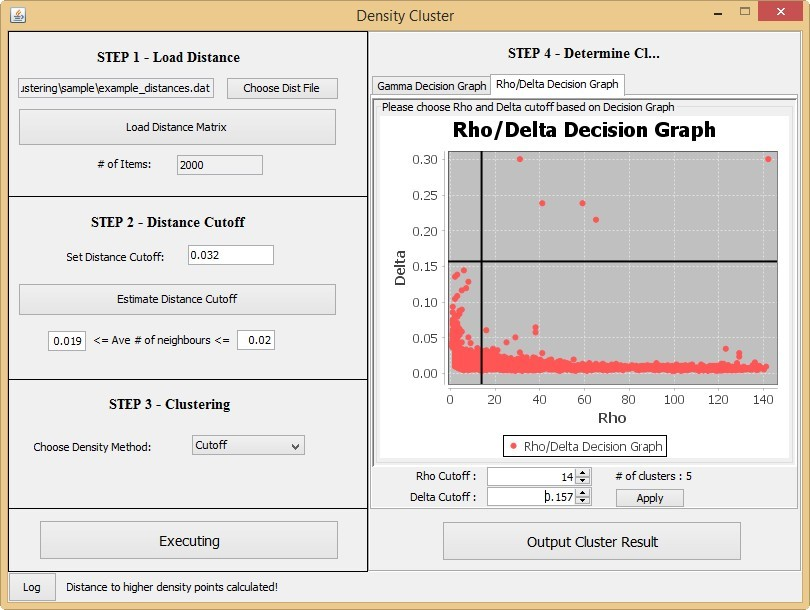

DensityClustering
=================
Java implementation of the new clustering method proposed by Rodriguez, A. and A. Laio, Clustering by fast search and find of density peaks. Science, 2014. 344(6191): p. 1492-6. with executable graphic user interface.

The core package contains the implementations of all modules/ procedures, including: distance matrix handler (one interface: DistanceBuilder, one abstract class: AbstractDistanceBuilder, and two implementation class: SimpleDistanceBuilder, MatrixFileDistanceBuilder), density calculation (one interface: DensityCalculator, two implementations: CutoffDensityCalculator and GaussianKernalDensityCalculator). Other classes includes a main class for the Clusterer.
    
The gui package contains the implementations of two decision graph, and a Main class for the executable UI.

    
The common package contains some utilities to handle files.